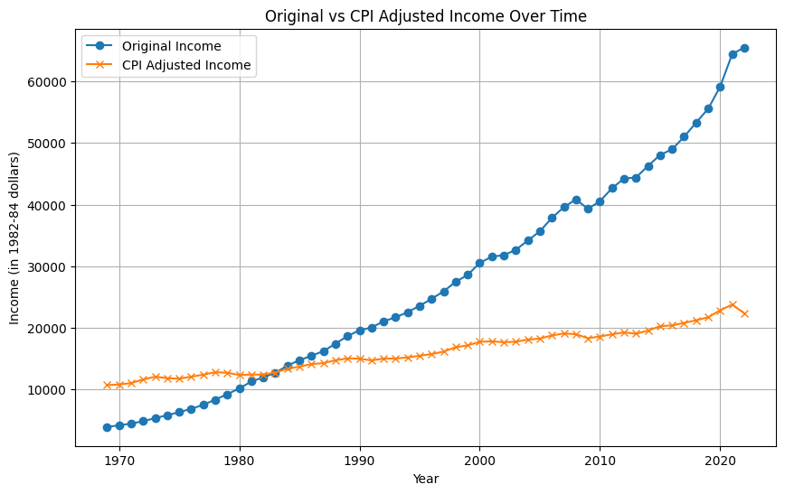

# The UnHealth Dashboard

I wanted to build a Dashboard related to public health for a portfolio project. 

Eventually, this became [The UnHealth Dashboard](https://bit.ly/UnHealthDashboard). 

It's deployed on Heroku so if the app is asleep it may take about 20 seconds to wake up.

This post will be the first in a series, explaining the process of creating the dashboard. 

## The Beginning: Finding the Data

Often, this is the most difficult part. I spent a lot of time looking through data related to public health. Mostly just Googling and looking through government websites (always well-structured and straightforward). 

I wanted to find a rich dataset, with a lot of interesting details, and that wasn't commonly used for toy projects. 

Initially I found two potential main datasets: the USDA's [Food Environment Atlas](https://www.ers.usda.gov/data-products/food-environment-atlas.aspx) and [PLACES](https://www.cdc.gov/places/index.html). 

The FEA contains data "such as store/restaurant proximity, food prices, food and nutrition assistance programs, and community characteristics". Simplistically one could ask, "do more fast food restaurants correlate with worse health". 

The PLACES dataset has data regarding many health measures, like the percent of people over 65 years old with all teeth lost,  at the local (census tract and ZIP code) level. 

I did a lot of EDA on both of these datasets, mostly in Jupyter notebooks. Here are some random charts from that:

---
<!DOCTYPE html>
<html lang="en">
<head>
<style>
.grid-container {
  display: grid;
  grid-template-columns: auto auto;
  gap: 10px;
}
.grid-item {
  text-align: center;
}
.grid-item img {
  width: 100%;
  height: auto;
  display: block;
  margin: auto;
}
</style>
</head>
<body>

<div class="grid-container">
  <div class="grid-item">
    
  </div>
  <div class="grid-item">
    
  </div>
  <div class="grid-item">
    
  </div>
  <div class="grid-item">
    
  </div>
</div>


</body>
</html>

---
My initial idea was to combine these two datasets in the dashboard with some more detailed economic data.

This led me to sources like the [BEA Income](https://apps.bea.gov/regional/downloadzip.cfm) (Bureau of Economic Analysis) and the [BLS](https://www.bls.gov/cpi/regional-resources.htm) (U.S. Bureau of Labor Statistics) which meant more EDA, e.g.:



---
But as I went on in developing the dashboard, I focused only on the CDC PLACES data as the main dataset, and the BEA and BLS as the supporting datasets. 

PLACES was easier to work with, cleaner, and had a lot of information in it. I felt like this would be more than enough for a project dashboard. I wanted to get a 'finished' product out in not too much time. 

Perhaps in the future I'll integrate the FEA dataset. 

## Code Setup

Once I had the main datasets determined and had done quite a bit of EDA to understand the data, it was time to get out of the Jupyter Notebooks and start developing in a more reproducible fashion, better suited for a dashboard. 

I usually develop in VSCode. 

For a data science project I use a [simplified version](https://github.com/SloughJE/template) of the [Cookiecutter Data Science](https://cookiecutter-data-science.drivendata.org/) structure. 


### Directory Structure

```
├── README.md          <- The top-level README for developers using this project.
│
├── Dockerfile         <- For developing inside a Docker container
│
├── data
│   ├── raw            <- The original, immutable data dump.
│   ├── interim        <- Intermediate data that has been transformed.
│   ├── processed      <- The final, canonical data sets for modeling.
│   └── results        <- results
│
│
├── models             <- Trained and serialized models, model predictions, or model summaries
│
├── notebooks          <- Jupyter notebooks. Naming convention is a number (for ordering),
│                         the creator's initials, and a short `-` delimited description, e.g.
│                         `1.0-jqp-initial-data-exploration`. Usually the notebooks would be used to explore the data and possible different models.
│
├── requirements.txt   <- The requirements file for reproducing the analysis environment
│
├── src                <- Source code for use in this project.
│   ├── __init__.py    <- Makes src a Python module
│   │
│   ├── data           <- Scripts to download or generate data
│   │   └── load_dataset.py
│   │
│   ├── features       <- Scripts to turn raw data into features for modeling
│   │   └── make_features.py
│   │
│   ├── models         <- Scripts to train models and then use trained models to make
│   │   │                 predictions
│   │   ├── predict_model.py
│   │   └── train_model.py
│   │
│   └── visualization  <- Scripts to create exploratory and results oriented visualizations
│       └── visualize.py
│
├── run_pipelines.py   <- file that manages the running of pipelines
│
└── params.yml         <- parameters 
```

One thing to note is that I have a Dockerfile included here. This means that in VSCode we can develop within this container so our environment is consistent and reproducible. 
Often I will modify this and just use a Python container like `python:3.11-slim-bullseye`.

With this structure we can run our pipelines by commands such as:

```bash
python run_pipelines.py --load_data
```
This `run_piplines.py` file manages the execution of all the pipelines. It allows us to run all steps in the project from the command line, ensuring reproducibility. We can add new pipelines as the project grows, by adding to this file.

Other mentions:

`requirements.txt`: Lists all Python dependencies required to run the project. Ensures that anyone can recreate the exact analysis environment by installing the listed packages.

`params.yml`: Here we can manage parameters centrally, making it easier to tweak and experiment with different settings without altering the codebase. Some examples of parameters could be hyperparameter setting for your model, filepaths, etc.

---
That's the setup and how I began The UnHealth Dashboard project. 

Next blog I'll get into the data loading and processing.

JS